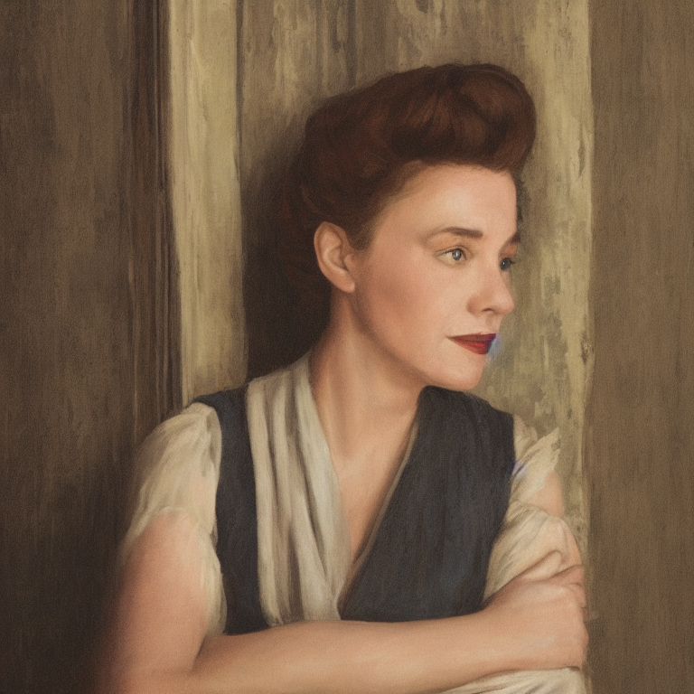
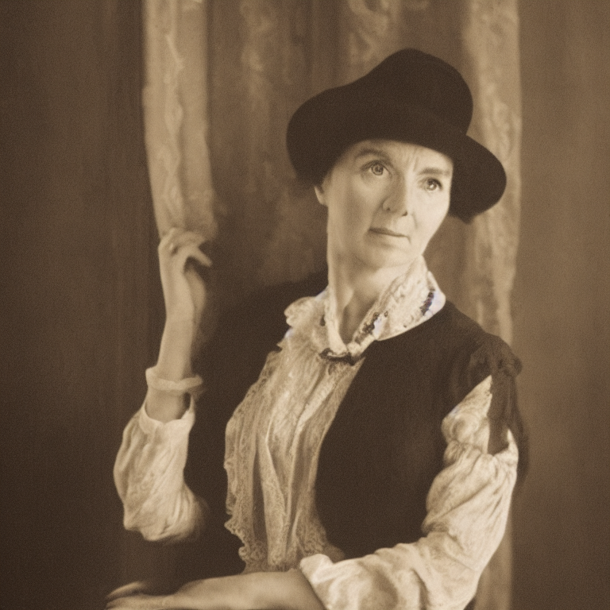
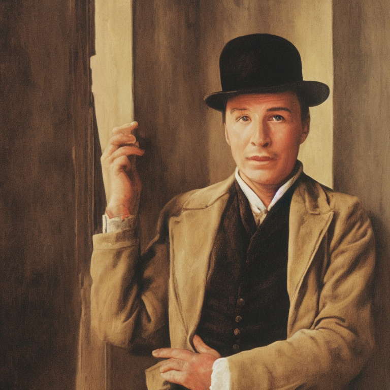

# Module 3: Text-to-Image Machine Learning

More details to come

<a name="project3"></a>

## Project 3: Using Text-to-image

- Due Fri Dec 16, 11:59pm

Your goal is to experience first-hand using a text-to-image (Stable Diffusion) to generate a piece of media.

You will need to:

- find a text to use as source material (e.g. project gutenberg [https://www.gutenberg.org/]). Download the .txt file then upload it into your colab. You will then read in this file with code similar to this:

```
f = open("/content/pg2641.txt", "r")
text = f.read()
```

- compute the most frequent noun phrases (use .noun_phrases [https://github.com/sloria/textblob] to get the noun phrases, then filter the list to select only the noun phrases that contain only alpha characters or spaces, the get the most frequent)
- generate a set of 4 images from the 4 most common noun phrases using Stable Diffusion (you will need to design your own prompt) (note: you might not be able to generate all four at once, but will need to call 'pipe' on one prompt at a time otherwise colab's GPU will run out of memory).

This will require you leverage your Python skills from the first half of the class, as well as a bit of prompt engineering.

Optional: fine-tune the model to produce images in a particular style

As an example, I used the book A Room With A View, by E. M. Forster.
I obtained the following noun phrase frequencies: ('lucy', 449), ('cecil', 235), ('miss bartlett', 198), ('freddy', 124).

Then, I generated the following four images.






<hr> 

## Lecture 3-1: Intro to Text-to-image

https://docs.google.com/presentation/d/16KVanb8DUQrtvyibYqlryn-ZnpCHDidwuv-aK8FjnhU/edit?usp=sharing

<hr> 

## Lecture 3-2: Prompt Engineering

https://docs.google.com/presentation/d/1Tm-CL_Pynli3ZJmQeA3VwJ6TKikhSpRdfhetPLvTtpM/edit?usp=sharing

<hr> 

## Lab 3: Testing out Stable Diffusion

The goal of this lab is to ensure you are ready to start interfacing with stable diffusion.
Your goal is to explore the impact of the ```inference_steps``` parameter.
Start by setting a random seed, and then design a prompt of your choosing, and generate 10 images, each with an increasing number of ```inference_steps``` (a range of roughly 1-150 is reasonable).
Write up a short description of what you observe.
How does the image change with more inference steps?

You should use this colab notebook as a starting point: [https://colab.research.google.com/drive/16vaTJi1o5139AlPPU-k-dggc3bx9qnL1?usp=sharing]
Make a copy of the notebook in your own drive, then generate the images.
Turn in your 

<hr> 

## Lecture 3-1: Fine tuning

<hr> 

## Lecture 3-1: More fine tuning and wrappping up
