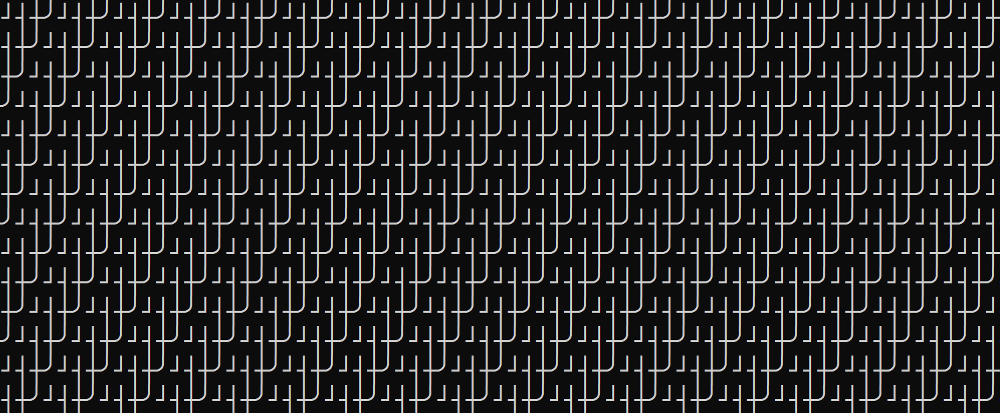

 
# Lab 3

## Generative Art v0.1 - Making Patterns

In this lab, we are exploring ```for``` loops. Loops in python take many different forms, but for now we will focus on the form ```for x in range (100)```. This will run a loop 100 times, at each iteration giving us access to the value of ```x```, which represents the current iteration number.

Today we explore loops through the lens of generative art. Very briefly, generative art is the practice of using an autonomous system to, well, generate art. Generally, generative art specifically talks about using autonomous system to generate an artifact that is too large or too detailed to have been created by hand. For us, that autonomous system will be loops in python.

Let's start by printing a pattern. The only thing that should be new here is ```print('/', end='')```. This says that rather than ending our print statement with a newline(which is the ```\\n``` character), we will end the print statement without any extra characters.

    for i in range(10000):
        print('/', end ='')

This pattern is a bit underwhelming so far, but it is generative art. We have generated an artifact (in this case an image of text) that would have been prohibitively boring to create by hand.

Let's try making a more interesting pattern. To this end, we just need to add a few more print statements.

    for i in range(10000):
        print('/', end ='')
        print('|', end ='')
        print('|', end ='')

Ok this is a bit interesting now. We may want to add ```\``` character. We are skipping ahead a bit, but this is called an *escape character*. To print this special character we need to escape the escape character by typing ```\\```. If that doesn't make sense, don't worry, just follow along - we only want to print fun patterns for now. 

    for i in range(10000):
        print('/', end ='')
        print('|', end ='')
        print('|', end ='')
        print('\\', end ='')

For a creative touch, try adding your own characters.

In particular try, characters from this set 

    ['─','│','┌','┐','└','┘','├','┤','┬','┴','┼','╭','╮','╯','╰']

Here is one example:

    for i in range( 10000):
        print('├', end ='')
        print('└', end ='')
        print('┘', end ='')
        print('┤', end ='')

## Task 1

You have received a commisson from a shoe making company, Valenciaga. They desperately need someone to generate the following pattern (nevermind the fact that they somehow already have this pattern) for their new limited edition sneakers (MSRP $5000 USD).



Write code to generate this pattern. This will be part 1 of your submission. Save this file as task1.py

## Generative Art v0.2

The characters above are from the PETSCII set of characters introduced on the Commodore 64 (note: understanding computing history is an important part of understanding computing in the arts).

One of the earlier examples of generative art on a general purpose computer was made using the Commodore 64. The program used the BASIC language of the Commodore 64 and was printed in the *Commodore 64 User's Guide* in 1982. 

    10 PRINT CHR$(205.5+RND(1)); : GOTO 10

Since this is not a course on BASIC, we will try to replicate this program in Python.

    from random import choice
    for i in range(10000):
        print(choice(['─','│','┌','┐','└','┘','├','┤','┬','┴','┼','╭', '╮' ,'╯' ,'╰']), end='')

Again, we have seen most of this before. The new components here are the ```choice``` function and the ```import``` bit at the top. Again, we will cover this in more detail later in the course - for now just know that ```from random import choice``` gives us access to the ```choice``` function which lives in the ```random``` library. The ```choice``` function then randomly makes a choice from the characters provided each time it executes. More on that later - for now let's just copy and paste the code and see what it does. Try removing some of the character and see what kinds of patterns come out.

For more on these interesting one line programs from the Commodore 64 era, check out Nick Montfort's book [10 PRINT](https://10print.org/).

This is fun, but what happens if you find a pattern you really like? How can you generate this same pattern again? Do you notice how you are getting new results everytime you run your code?

To fix this, we need to import one more function - this one is called ```seed```. The short explination is that seed allows us to get the same random selection again and again. You can put any number in the seed function - each one will create a unqiue pattern. But once you have set a seed value, you get the same pattern every time you run the code. See the example below.

    from random import choice
    from random import seed
    seed(42)
    for i in range(10000):
        print(choice(['─','│','┌','┐','└','┘','├','┤','┬','┴','┼','╭', '╮' ,'╯' ,'╰']), end='')

## Task 2

Valenciaga was so impressed with your work, they want you to make a new pattern of your own. Leverage the ```random``` and ```seed``` functions introduced above, as well as the deterministic patterns to compose a sequence of loops (some random, some not random) to come up with your own design.

This code will be part 2 of your submission. Save this file as task2.py. Zip both files and submit the zip with the name [uni]-lab3.zip.

<!--- If you are interested in further examples of code generating art from a single simple loop, you may be interested in [Nick Montfort's Through the Park](https://nickm.com/poems/through_the_park.html) (the website is implemented in Javascript, but the Python source code is also available on the site). As a word of warning, this work is "art" in every sense of the word - it evokes some very intense imagery and will probably make you uncomfortable at least. Far more than might be expected for a single Python loop. --->
