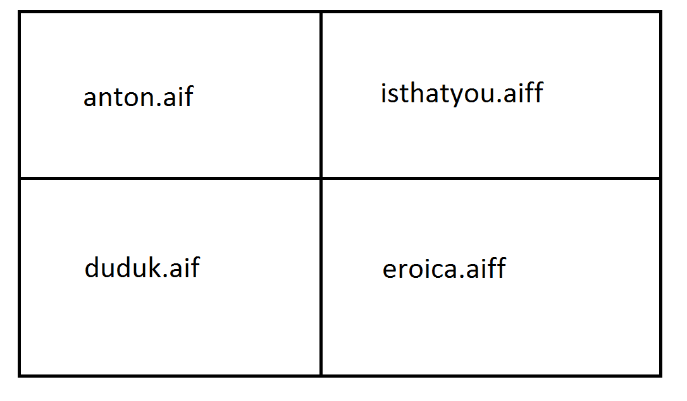

# Exam

Download [this template](/ggu/music/midterm.maxpat) to get started.
So far in class we have covered the fundamental mechanics of the Max programming language.
This exam will test your ability to use the documentation to learn more on your own.
This exam is open book, use any resources at your disposal, except your neighbors.
Do NOT chat, text, or otherwise communicate with anyone in the class.

You will use two new objects in the exam.

- mousestate
- TogEdge

The exam is broken into three parts. Do not move on until you have completed each section.

*Part I - 50 pts*
Make a program that will play different samples as you scroll your mouse around the screen.
Define four areas, as shown in the image below.



*Part II - 40 pts*
When you click the mouse button, play another sample.

*Part III - 10 pts*
Use a selection of samples that work well together musically and perform your own piece. Post a recording on the soundcloud group. Put a link to the recording inside your program using the ```comment``` object.

**To Submit**

Submit your max program as an attachment on the lms and submit before noon.
