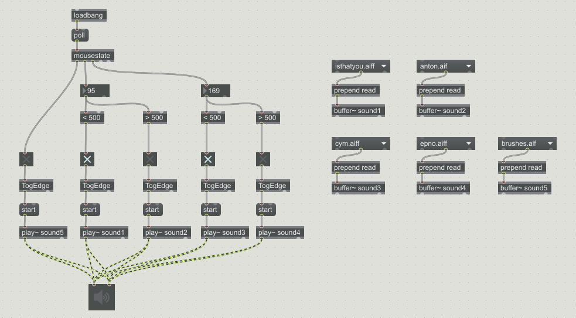

# Computer Music

#### Join the [soundcloud group](https://soundcloud.com/groups/ggu-computer-music)!

All recordings you make should be added to the group.

<iframe width="50%" height="300" scrolling="yes" frameborder="yes" src="https://w.soundcloud.com/player/?url=https%3A//api.soundcloud.com/groups/253205&amp;color=0066cc&amp;auto_play=false&amp;hide_related=false&amp;show_comments=false&amp;show_user=true&amp;show_reposts=false"></iframe>

<hr>
## 5/19

We listened to everyone's submissions and picked a winner for the prize bag.
The winner was...

<iframe width="50%" height="120" scrolling="no" frameborder="no" src="https://w.soundcloud.com/player/?url=https%3A//api.soundcloud.com/tracks/264885980&amp;auto_play=false&amp;hide_related=false&amp;show_comments=true&amp;show_user=true&amp;show_reposts=false&amp;visual=false"></iframe>

We reviewed how to use audacity to create samples that can be used in LMMS.

<iframe width="420" height="315" src="https://www.youtube.com/embed/kONijDwgNDg" frameborder="0" allowfullscreen></iframe>

#### Homework - due 5/24 @ 10am

Make a remix of a Buddhist chant.
Use the "Buddhist Chant Demo" as an example.
Your song should be at least 30 seconds.


<iframe width="50%" height="120" scrolling="no" frameborder="no" src="https://w.soundcloud.com/player/?url=https%3A//api.soundcloud.com/tracks/264881675&amp;auto_play=false&amp;hide_related=true&amp;show_comments=true&amp;show_user=false&amp;show_reposts=false&amp;visual=false"></iframe>

<hr>
## 5/17

Starting with LMMMS. Download the program at [LMMS.io](https://lmms.io/).

We made our first beat and used the map from the previous class to compose a new song.

We will schedule our makeup classes on Thursday nights at 10pm.

#### Homework - due 5/19 @ 10pm

Finish the song we started in class.
Use the map from last week to guide your composition.
Upload your submission to the soundlcoud group before class on Thursday.


<hr>
## 5/10

Review of the midterm. You can [download the solution](/ggu/music/samples/midtermSolution.maxpat), or just view the program below.



We will form groups and work on a similar project. This time, you will need the following objects:

- ```meter```
- ```TogEdge```
- ```>```

Whenever the meter goes about a certain value, play a sample.

#### Mapping a song

In order to start making real music, we need to plan how the music should sound. Let's practice in class with this song.
<p>
MOIA?
<audio controls>
  <source src="/ggu/music/samples/MAMAMOO.mp3" type="audio/mpeg">
Your browser does not support the audio element.
</audio></p>


#### Homework
Next, we will begin a group project. We will form teams to compose a piece of music using max, audacity, and other programs. For homework this week, in your groups, write down a sketch of the song you want to make. Turn this assignment in during class, on paper. We will not use the LMS for this assignment.

If you were not in class, and do not have a group, complete this assignment on your own.
You will be assigned a group next week.

<hr>
## 5/03

Midterm today!

Download [this template](/ggu/music/midterm.maxpat) to get started.
So far in class we have covered the fundamental mechanics of the Max programming language.
This exam will test your ability to use the documentation to learn more on your own.
This exam is open book, use any resources at your disposal, except your neighbors.
Do NOT chat, text, or otherwise communicate with anyone in the class.

You will use two new objects in the exam.

- mousestate
- TogEdge

The exam is broken into three parts. Do not move on until you have completed each section.

*Part I - 50 pts*
Make a program that will play different samples as you scroll your mouse around the screen.
Define four areas, as shown in the image below.


*Part II - 40 pts*
When you click the mouse button, play another sample.

*Part III - 10 pts*
Use a selection of samples that work well together musically and perform your own piece. Post a recording on the soundcloud group. Put a link to the recording inside your program using the ```comment``` object.

**To Submit**

Submit your max program as an attachment on the lms and submit before noon.

<hr>
## 4/26

Exam next week 5/03. In class programming assignment.

### Remember!

- Use the help files - right click on an object to learn more.
- Use the inspector to view details about an object.
- You can always search google or naver for help.

### Practice Exam


Start with [this program](/ggu/music/samples/simpleMax.maxpat). You need to add the following components.

- Use the ```slider``` object to control the *velocity*, or volume of the midi notes. The velocity should range from 0-127.
- Use the ```kslider``` object to play midi notes from a keyboard. The keyboard should display notes 41-59.
- Use the ```dial``` object to control the *duration* of the midi notes. The lowest setting should be 100, and the highest setting should be 1000.
- Use ```metro``` and ```counter``` to play a sequence of notes.


Start with [this program](/ggu/music/samples/simpleMSP.maxpat). You need to add the following components.

- Use the ```key``` and ```select``` object to use the keyboard to trigger a sound. Play a sample when you press the 'a' key.
- Use the ```saw~``` and ```*~``` to combine the sample sound with a sawtooth wave.

<hr>
## 4/19

### Max programming

*Practice for the exam.* Work on a patch using the ```key``` object.
Link 5 samples to five keys on the keyboard.
For example, if I press 'a', Max should play the 'isthatyou.aiff' sound.
Use a loop and then play your samples on the keyboard to create a 45 second recording.
Post the recording to soundlcoud and make the image a screenshot of your max patch.
On the real exam, you will also upload the .maxpat file on the LMS.

After everyone is finished, we will review the ```key``` object together as a class to see how it works.

### Homework
Practice learning new objects and making a patch with it.
Here are some good ones to practice with:

- ```slider```
- ```mousestate```

All the object we have already learned may also be on the exam.

GENERAL

- ```umenu```
- ```prepend```
- ```preset```
- ```toggle```
- ```metro```
- ```counter```
- ```select```

MIDI

- ```makenote```
- ```noteout```
- ```pgmout```

WAVES

- ```cycle~```
- ```*~```
- ```+~```
- ```buffer~```
- ```groove~```
- ```buffer~```
- ```play~```


<hr>
## 4/12

We learned about RAM vs disk and how to play samples quickly in Max.
See a record of this class [here](/ggu/music/samples/4_12).

<hr>
## 4/05

We listened to the Theremin and learned about wave forms.
See a record of this class [here](/ggu/music/4_05).

<hr>
## 3/29

We listened to some historical computer music and learned about the theory behind Max.
See a record of this class [here](/ggu/music/3_29).

<hr>
## 3/22

We had an [introduction to Max](/ggu/music/intro_to_max)

<hr>
## 3/15

No class today, we will make up class later in the semester.

<hr>
## 3/8

We [learned how to use Audacity](/ggu/music/intro_to_aud) and listened to examples of *sampling*.
