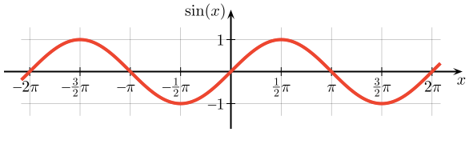

# Computer Music

## 4/05

#### Join the [soundcloud group](https://soundcloud.com/groups/ggu-computer-music)!

### Computer Music History

We are learning about wave forms today.
This is the most basic unit of sound.
The sine wave is the most famous.

The Theremin plays sounds that are close to sine waves.
Here is a video, and an [online demo](http://www.google.com/doodles/clara-rockmores-105th-birthday) of how it works.

<iframe width="420" height="315" src="https://www.youtube.com/embed/pSzTPGlNa5U" frameborder="0" allowfullscreen></iframe>

### Max programming

We can create these waves in Max, and listen to them.
[This patch](/ggu/music/samples/waveDemo.maxpat) plays a triangle wave, a sawtooth wave, and a sine wave.

There are two kinds of cords in Max, green for signals (repeated numbers) and grey for discrete data (single numbers).

When using signals, we will need some new objects. Look at the help files for the following

- cycle~
- *~
- +~
- buffer~
- groove~

### Homework

Make a recording of a wave form you like and post it to soundcloud.

## 3/29

We listened to some historical computer music and learned about the theory behind Max.
See a record of this class [here](/ggu/music/3_29).

## 3/22

We had an [introduction to Max](/ggu/music/intro_to_max)

## 3/15

No class today, we will make up class later in the semester.

## 3/8

We [learned how to use Audacity](ggu/music/intro_to_aud) and listened to examples of *sampling*.
